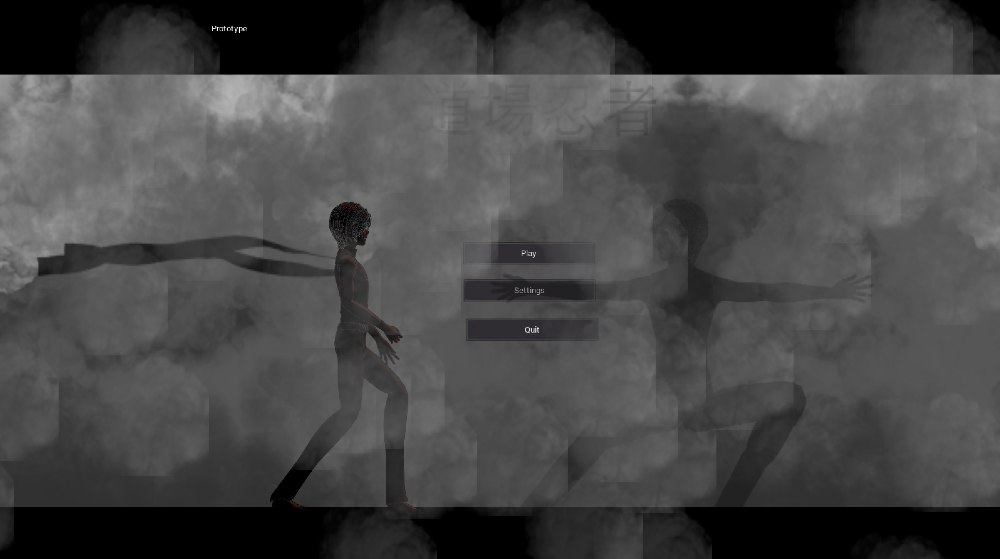

Godot 2.1+ breaks this project.

**Dojo Ninjas** is a collaborative game made with the [Godot Game Engine](http://www.godotengine.org/projects/godot-engine) by the [CoderDojo Ninjas of McDonough](http://www.coderdojohenry.com) comprised of children ranging in age from 7-18. 

It is currently a work in progress. 

