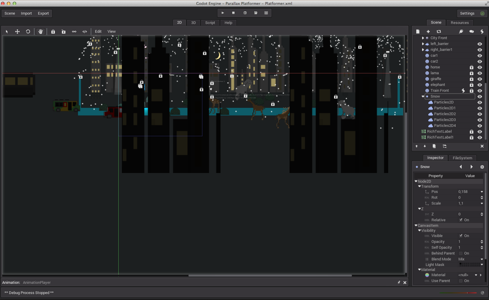

## Parallax Platformer

Just a modification to my Platformer [video tutorial](https://www.youtube.com/watch?v=Elw3KEz7TwQ).

Art was made with [@piskelapp](https://twitter.com/piskelapp).

- To achieve this effect, just add a parent a ParallaxLayer node to a ParallaxBackground node, and parent a sprite (or multiple sprites) to that.

- Make sure the **mirroring** along the x-axis (or y-axis if you want it to go from top to bottom), is offset enough. This is found in the ParallaxLayer node.

- The foreground moves faster because the **scale** along the x-axis is higher. I think that's how it works in real life, or at least in movies.

[@TutorialDoctor](https://twitter.com/TutorialDoctor)
