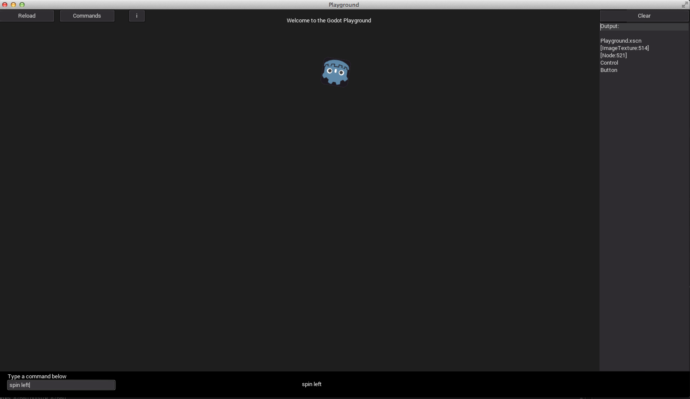

Play around in Godot in the Godot Playground.

Use this demo to learn how Godot's Control and Node2D nodes can work together.

This demo allows you to type a text command and see graphics perform those commands.
Edit the code to add your own custom commmands. 

# The Video
[Watch the Video](https://www.youtube.com/watch?v=txKpVqBnG7Y&feature=youtu.be)
