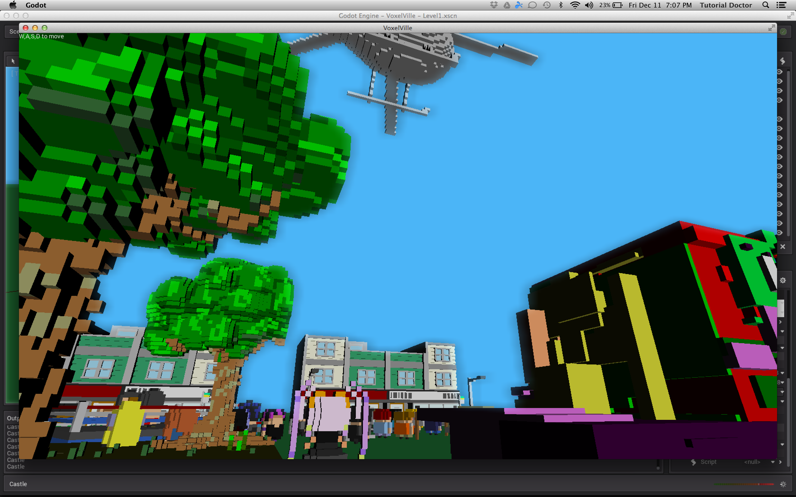

Thank you [@mikelovesrobots](https://twitter.com/mikelovesrobots) and [@epthtracy](https://twitter.com/ephtracy).

Voxelville with the [Godot](http://www.godotengine.org/projects/godot-engine) game engine and MagicaVoxel.

First person camera code is a dissection of the FPS test demo. 

[@TutorialDoctor](https://twitter.com/TutorialDoctor)

